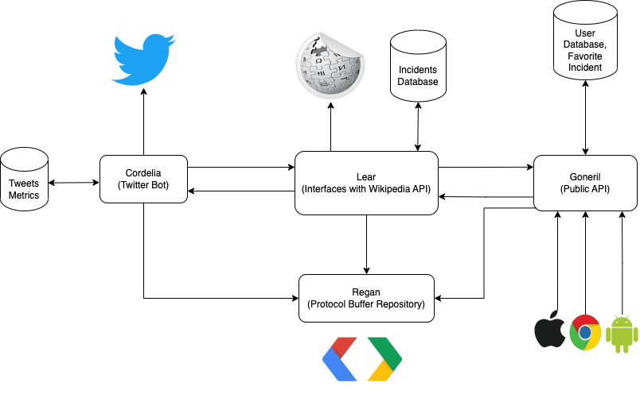

# History Rewinded

### The aim of this small project is to create:

- A Twitter bot that tweets throughout the day the important events that happened back in history
- An API for a mobile application that pushes notification throughout the day of important events

### The Project consists of 4 go microservices:

- Lear: This Go microservice is the central one, and will be responsible for:
    - Providing the data for the twitter bot (Cordelia) and the REST API (Goneril)
    - Send requests to the Wikipedia API and manage the responses and saving them in the database
- Cordelia: This Go microservice is responsible for tweeting and logging the tweet status if it was successful or has failed
- Regan: This Go module is the repository for protobuff files that will be used by the three microservices to generate the client and the server stubs for the remaining microservices
- Goneril: This Go microservice is response for providing the data to the mobile clients and saving the data relevant for the user (favorite events, usernames, etc..)

